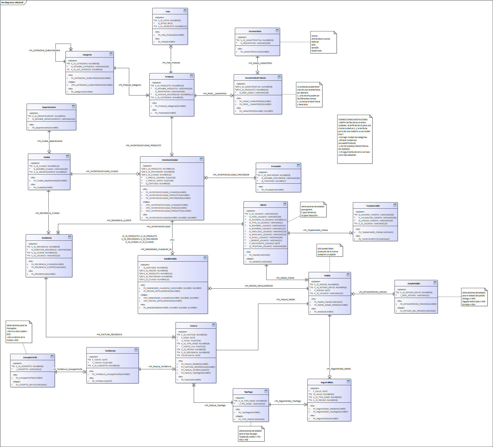

# Store FIS
Tienda de barrio que se aplica las metodologías de historias de Usuario

# Integrantes
* David Steven Santos 
* Edwin Hernandez Cabrera

# Roles de la tienda
* Vendedor
* Proveedor
* Cliente
* Domiciliario

# Funcionalidades básicas de la tienda
* Ventas Online (E-Commerce) de productos perecederos y no perecederos
* Gestión de inventario
* Domicilio y seguimiento de pedidos facturados
* Intercomunicacion entre cliente, vendedor, proveedores y domicialirio(logística)
* Recomendaciones personalizadas de ofertas a clientes

# Historias de Usuario:

### Cliente 
* Como cliente se desea solicitar al tendero productos vía web
* Como cliente puede seleccionar diferentes productos y agregarlos a mi pedido
* Como cliente se puede programar la hora de entrega
* Como cliente selecciono productos y agregarlos a mi pedido de manera grafica para facilitar la compra
* Como cliente puedo seleccionar la lista de mis pedidos para poder cancelar un pedido
* Como cliente cancelo parcialmente productos de mi pedido para facilitar los procesos de compra
* Como cliente ingreso un motivo de cancelacion de un pedido para aclarar porque se cancela dicho pedido
* Como cliente puedo tener un recordatorio de los pedidos mas frecuentes para ayudarme a organizar mis compras
* Como cliente tengo un historial de compras.
* Como cliente deseo buscar promociones segun mis preferencias para obtener mejores beneficios

### Tendero
* Como tendero deseo una lista ordenada de pedidos recibidos para poder despachar sin perder pedidos 
* Como tendero deseo poder administrar la lista de pedidos recibidos para organizar el negocio
* Como tendero deseo que los productos ofertados esten enlazados en inventario para poder ofrecer productos en existencia
* Como tendero deseo tener control del inventario para saber que conseguir para hacer el inventario atractivo a compradores
* Como tendero deseo conocer por avisos los productos que están por terminarse en inventario para poder gestionarlos
* Como tendero deseo tener reportes sobre productos con mas solicitudes para gestion del inventario
* Como tendero deseo crear campaña promocional como difusion a clientes para mejorar el negocio
* Como tendero deseo que la orden del pedido lista genere factura para ser enviada con el domiciliario

### Domiciliario
* Como domiciliario deseo agrupar mis entregas para hacer eficiente mi trabajo

# Tareas del primer ciclo
* Definición de arquitectura
  - Frameworks a utilizar 
  - Modelos a implementar
* Configuración de ambiente
  - Definición de versiones a utilizar (Ej: version de framework, motor de base de datos, etc)
  - Configuración de ambiente local
* Modelado de usuario
* CRUD para usuarios

### Modelo de base de datos 

Mockups - UI Kit
https://www.figma.com/file/7Qutnn9fJebmLk1as3S9oM/Store-UD-app-Ui-kit?node-id=0%3A1
